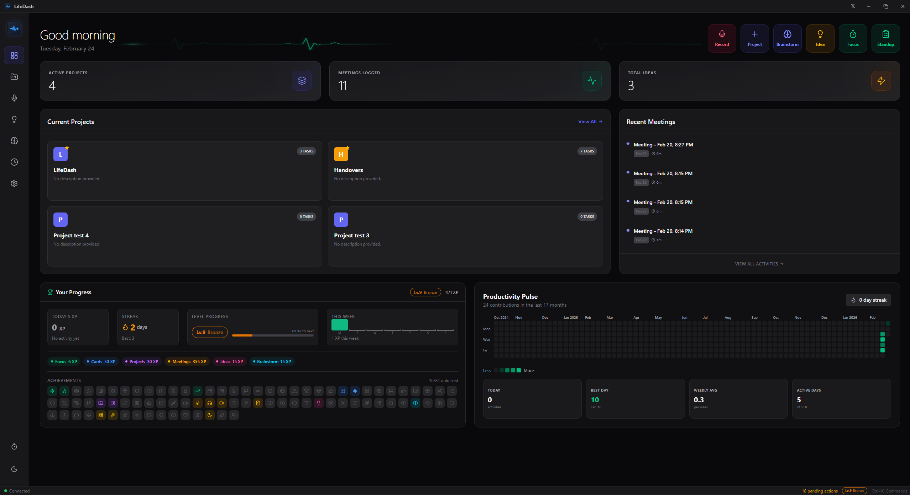

# LifeDash

AI-powered desktop dashboard for meeting intelligence, project management, brainstorming, and idea tracking.

<p align="center">
  
</p>

## Features

- Meeting recording with real-time transcription (local Whisper + API fallback via Deepgram/AssemblyAI)
- Kanban project management with drag-and-drop
- AI-powered meeting briefs and action item extraction
- Speaker diarization and meeting analytics
- Conversational AI brainstorming
- AI task structuring and project planning
- Idea repository with tags, analysis, and project conversion
- Multi-provider AI support (OpenAI, Anthropic, Ollama, Deepgram, AssemblyAI)
- Database backup/restore and data export
- Desktop notifications for due dates and daily digest
- Dark theme UI with system tray integration

## Installation

### Prerequisites

- [Node.js](https://nodejs.org/) 18+ (includes npm)
- [Git](https://git-scm.com/)
- **Windows only:** [Visual Studio Build Tools](https://visualstudio.microsoft.com/visual-cpp-build-tools/) with "Desktop development with C++" workload (required for native modules)

### Setup

```bash
git clone https://github.com/Lab-51/lifedash.git
cd lifedash
npm install
npm start
```

That's it — no database setup needed. The app uses an embedded database (PGlite) and runs migrations automatically on first launch.

### Troubleshooting

| Problem | Solution |
|---------|----------|
| `npm install` fails with `node-gyp` errors | Install [Visual Studio Build Tools](https://visualstudio.microsoft.com/visual-cpp-build-tools/) with C++ workload |
| `npm install` fails with Python errors | Install Python 3.x and set `npm config set python python3` |
| Permission errors on clone | Ensure you have repo access — this is a private repository |
| App shows white screen on start | Run `npm run lint` to check for TypeScript errors |

## Available Scripts

| Script | Command | Description |
|--------|---------|-------------|
| `npm start` | `electron-forge start` | Launch the app in development mode |
| `npm run package` | `electron-forge package` | Package the app for distribution |
| `npm run make` | `electron-forge make` | Build platform-specific installers |
| `npm run lint` | `tsc --noEmit` | Type-check with TypeScript |
| `npm test` | `vitest run` | Run tests once |
| `npm run test:watch` | `vitest` | Run tests in watch mode |
| `npm run test:ui` | `vitest --ui` | Run tests with Vitest UI |
| `npm run db:generate` | `drizzle-kit generate` | Generate database migration files |
| `npm run db:migrate` | `drizzle-kit migrate` | Apply database migrations |
| `npm run db:studio` | `drizzle-kit studio` | Open Drizzle Studio (database GUI) |

### Optional: Docker Development Database

These commands require [Docker Desktop](https://www.docker.com/products/docker-desktop/) and are only needed for drizzle-kit studio or direct SQL access during development:

| Script | Command | Description |
|--------|---------|-------------|
| `npm run db:up` | `docker compose up -d` | Start the PostgreSQL container |
| `npm run db:down` | `docker compose down` | Stop the PostgreSQL container |

## Tech Stack

| Category | Technology | Version |
|----------|-----------|---------|
| Runtime | Electron | 40.x |
| Frontend | React | 19.x |
| Language | TypeScript | 5.9 |
| Styling | Tailwind CSS | 4.x |
| Database | PGlite (embedded) | 0.3.x |
| ORM | Drizzle ORM | 0.45 |
| AI SDK | Vercel AI SDK (`ai`) | 6.x |
| AI - OpenAI | @ai-sdk/openai | 3.x |
| AI - Anthropic | @ai-sdk/anthropic | 3.x |
| AI - Ollama | ollama-ai-provider | 1.2 |
| Transcription | @fugood/whisper.node | 1.x |
| Drag and Drop | @atlaskit/pragmatic-drag-and-drop | 1.x |
| State | Zustand | 5.x |
| Rich Text | TipTap | 3.x |
| Animation | Framer Motion | 12.x |
| Icons | Lucide React | 0.563 |
| Routing | React Router | 7.x |
| Build | Vite | 7.x |
| Testing | Vitest | 4.x |

## Project Structure

```
src/
  main/               # Electron main process
    db/                # Schema, migrations, connection
    ipc/               # IPC handlers (100+ channels across 17 modules)
    services/          # Business logic (AI, transcription, backup, etc.)
    workers/           # Background workers (transcription)
  preload/             # Electron preload bridge
  renderer/            # React frontend
    components/        # Reusable UI components
    hooks/             # Custom React hooks
    pages/             # Route pages (Board, Meetings, Ideas, etc.)
    services/          # Frontend service layer
    stores/            # Zustand state management
    styles/            # Global styles
  shared/              # Types and utilities shared across processes
```

## Configuration

**AI API keys:** Configured in the Settings page within the app. Keys are stored using OS-level encryption via Electron safeStorage.

**Whisper model:** Download and manage local Whisper models from the Settings page.

**Transcription providers:** Deepgram and AssemblyAI can be configured as cloud transcription alternatives to local Whisper.

## Contributing

See [CONTRIBUTING.md](CONTRIBUTING.md) for guidelines on reporting issues and submitting pull requests.

## License

This project is licensed under the [MIT License](LICENSE).
