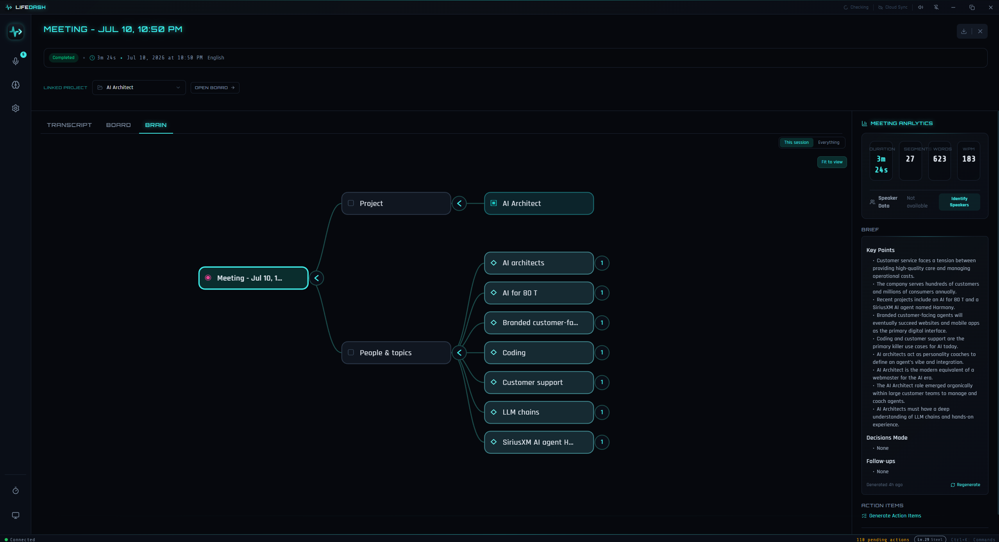

<div align="center">


# LifeDash

**Your meetings. Your data. Your machine.**

Source-available meeting intelligence with a **learning digital twin**, running entirely on your desktop. Free for personal and noncommercial use; commercial use requires a license.
Record a meeting and the app _becomes_ that session: a profiled AI assistant works alongside you, everything said turns into a living, searchable knowledge graph, and nothing ever leaves your computer.

[](https://github.com/Lab-51/lifedash/releases/latest)
[-000000?style=for-the-badge&logo=apple&logoColor=white>)](#macos)

[](LICENSE)
[](https://github.com/Lab-51/lifedash)
[](https://github.com/Lab-51/lifedash/releases/latest)

<br />



_A finished session on the **Brain** tab: the meeting rendered as a mind map, with analytics and its AI brief alongside. One tab over sits the full transcript; another, the project board._

[Website](https://lifedash.space) · [Report Bug](https://github.com/Lab-51/lifedash/issues) · [Request Feature](https://github.com/Lab-51/lifedash/issues)

</div>

---

## What is LifeDash?

LifeDash records your meetings, transcribes them locally with Whisper, and generates briefs and action items. All of it works offline, with no accounts. But it goes further than a transcriber: **the recording session is the center of the app.**

A **Digital Twin**, built from a profile of your work and continuously learning from every session, works visibly alongside you during a meeting. It answers questions, proposes actions, and creates cards on a built-in Kanban board. Everything it hears builds a **living, queryable brain** (sessions → projects → cards → decisions → people) that you can watch grow as a mind map and search in plain language. Ask _"what did we decide about pricing?"_ and get an answer, with citations, **from your own past meetings.**

Connect your **Google or Outlook calendar** and your week is right there: click an upcoming meeting to see who's coming, what was decided last time, and which action items are still open, then start recording it in one click.

All of it runs **100% locally by default**. Audio, transcription, reasoning, embeddings, and memory never have to leave the machine; cloud is a per-task, clearly labeled opt-in.

### Platform Support

| Platform               | Status                                                                                      |
| ---------------------- | ------------------------------------------------------------------------------------------- |
| Windows 10+            | Available. [Download the installer](https://github.com/Lab-51/lifedash/releases/latest)     |
| macOS 12.3+ (Monterey) | Beta. `brew tap lab-51/lifedash && brew install --cask lifedash` ([manual install](#macos)) |
| Linux                  | [Planned](https://github.com/Lab-51/lifedash/issues/2). Contributions welcome               |

## Why LifeDash?

| Feature                              |         LifeDash          |  Otter.ai   |  Fireflies  |   Fathom    |
| ------------------------------------ | :-----------------------: | :---------: | :---------: | :---------: |
| Local processing                     |            Yes            |     No      |     No      |     No      |
| Data leaves your machine             |           Never           |   Always    |   Always    |   Always    |
| Works offline                        |            Yes            |     No      |     No      |     No      |
| Meeting transcription                |            Yes            |     Yes     |     Yes     |     Yes     |
| AI briefs & summaries                |            Yes            |     Yes     |     Yes     |     Yes     |
| Action item extraction               |            Yes            |     Yes     |     Yes     |     Yes     |
| Project management                   |            Yes            |     No      |     No      |     No      |
| Calendar integration                 |            Yes            |     Yes     |     Yes     |     Yes     |
| Learning digital-twin assistant      |            Yes            |     No      |     No      |     No      |
| Ask your own meetings (cited, local) |            Yes            |     No      |     No      |     No      |
| Bring your own AI key                |            Yes            |     No      |     No      |     No      |
| Source code you can inspect          |            Yes            |     No      |     No      |     No      |
| **Price**                            | **Free for personal use** | **$204/yr** | **$216/yr** | **$384/yr** |

## Download

**Just want to use it?** Grab the installer. No dev tools needed.

### Windows

1. Go to the [latest release](https://github.com/Lab-51/lifedash/releases/latest)
2. Download `LifeDash-X.X.X-Setup.exe`
3. Run the installer
4. Open LifeDash and pick **"Private — AI runs on this computer"** in the setup wizard. See [Setting up AI](#setting-up-ai) below
5. Start recording

### macOS

**Option A — Homebrew (recommended):**

```bash
brew tap lab-51/lifedash && brew install --cask lifedash
```

**Option B — Direct DMG download:**

1. Download `LifeDash-X.X.X-mac-arm64.dmg` from the [latest release](https://github.com/Lab-51/lifedash/releases/latest)
2. Open the DMG, drag LifeDash to Applications
3. **Important:** macOS will show "LifeDash is damaged" because the app is not yet Apple-notarized. Run this once to fix it:
   ```bash
   xattr -cr /Applications/lifedash.app
   ```
4. Open LifeDash normally

> Requires macOS 12.3 (Monterey) or later. Apple Silicon only (M1/M2/M3/M4).

> The app uses an embedded database and runs fully offline. No accounts, no cloud, nothing to configure beyond the installer.

## Setting up AI

The setup wizard's first question is where your AI should run. The recommended
answer, **"Private — AI runs on this computer"**, needs no key, no account, and
nothing installed alongside LifeDash.

### Built in (recommended)

LifeDash ships a local AI runtime ([llama.cpp](https://github.com/ggml-org/llama.cpp),
GPU-accelerated: Vulkan on Windows for NVIDIA/AMD/Intel, Metal on Apple Silicon,
with a CPU fallback). You pick a model from a built-in catalog and LifeDash
downloads it straight from Hugging Face, resumable and checksum-verified.

- **Start here if you're unsure:** _Qwen3 4B_ (~2.5 GB, 8 GB RAM). It's the smallest
  model that can also _act_ (create and move cards for you), not just answer.
- Bigger machine? _Qwen3 14B_ and _Mistral Small 24B_ are in the same list.
- Semantic search additionally uses a small embedding model (~0.3 GB) that the
  wizard sets up for you in the same step.
- Models are plain `.gguf` files under your app data folder. Delete one from
  **Settings → AI & Models → Local AI** and the disk space comes straight back.

Nothing runs until you use it: the runtime starts on demand, shows up as a status
card you can stop by hand, and shuts itself down after 15 idle minutes. Installing
LifeDash never starts a model.

### Alternatives (power users)

Prefer to manage models yourself, or already have a server running? All of these
are still first-class, configured per task under **Settings → AI & Models**:

| Option                                           | When it makes sense                                                               |
| ------------------------------------------------ | --------------------------------------------------------------------------------- |
| **LM Studio**                                    | You already curate models there, or want one server shared across apps            |
| **Ollama**                                       | You prefer its CLI/model management                                               |
| **Cloud keys** (OpenAI, Anthropic, Gemini, Kimi) | You want frontier-model quality and accept that those requests leave your machine |

Cloud is never a default and never silent: it's a per-task, clearly labeled choice,
and LifeDash warns before sending bulk content anywhere.

## Features

### The Session Workspace

- The recording session is home: **Transcript · Board · Brain** on one switchable canvas
- A live rail for the brief, action items, twin proposals, and a session activity feed
- The relevant Kanban board is embedded right in the session. Cards appear and move live as they're created, without leaving the conversation
- Post-meeting, each session is its own full page you can revisit, search, and continue working from

### The Digital Twin

- Author a profile of the professional you are: through a guided wizard (fully manual, or with an optional local-AI "Interview me" draft you always review), from a short brief, or mined from your own meeting history with explicit per-run consent
- Once authored, the Twin is woven into the **live assistant, live triage, and briefs**, so they speak your vocabulary, track your projects and people, and match your tone, within a strict budget that never crowds out the meeting
- **It learns from every finished session**, distilling a few durable facts (people, projects, preferences, commitments) into an **auditable memory**: every fact links to the session it came from, one tap forgets it for good, and a single switch pauses all learning
- Optional cited web research and deep, orchestrated profile creation on a frontier provider. Nothing is saved until you confirm

### Your Calendar, In the App

- Connect **Google Calendar** and/or **Microsoft Outlook**. Read-only, and you pick exactly which calendars sync
- Your week is always on the home screen, in the shape you prefer: a **day-grouped list**, a **week board**, or an **Outlook-style hour timeline** (your choice is remembered)
- A ribbon surfaces the meeting that's about to start, with **one-click recording** that prefills the title and project. Nothing is ever recorded automatically
- Click any meeting for its details (attendees, the invite description, the suggested project) plus **what happened last time**: a snippet of the previous brief and the action items still open from it, drawn from your own past sessions with no AI call
- Ask for a **prep note** and your local model writes a short briefing from that context, only when you press the button
- Recurring meetings learn their project: record the same series against a project twice and LifeDash starts suggesting it
- Calendar data is stored **locally only**. Titles, times, attendees, and descriptions live on your machine and are never synced anywhere

### Meeting Intelligence

- Record system audio + microphone
- Real-time transcription (local Whisper or cloud providers)
- AI-generated meeting briefs and summaries
- **A long meeting still gets a brief**: when a transcript outgrows your local model's context window, LifeDash summarizes it in passes and says so on the brief, instead of failing or silently truncating
- Automatic action item extraction, turned into board cards in one click
- Speaker diarization and meeting analytics
- A proactive in-meeting assistant that proposes actions (propose → one-tap accept) and executes board work as you talk
- **Chat with a finished meeting**: ask what was discussed and get answers grounded in that transcript, with timestamps. Read-only by design: it answers, it never touches your board
- **Inactivity auto-stop**: if a recording is left running in silence, you get a warning and a countdown before it stops itself cleanly (on by default, configurable)

### The Living Brain

- A collapsible **mind map** of your workspace, or of a single session, rendered from your own local data and organized into **Projects · People · Topics**
- It **grows live** during a meeting: new cards fade in, with a badge on collapsed branches so nothing is missed
- Hover any card, decision, or question to trace its provenance back to the session it came from
- **People and topics carry fact profiles**: durable facts the Twin learned about them, each showing which session it came from, with one-tap forget. Backfill any person or topic from your past meetings on demand, never automatically

### Search That Understands Meaning

- Full-text search across sessions, transcripts, briefs, cards, and projects. Grouped, ranked, one click to jump in
- **Semantic search:** a paraphrase finds the right session even when the words don't match
- **Ask:** get a short, cited answer drawn straight from your own sessions, and an honest "I don't find that in your sessions" instead of a guess
- **Local-first:** the index is built on-device by default; choosing a cloud embedding model warns you, at that moment, that your content would be sent. It never happens silently

### Project Board

- Turn action items into Kanban cards, seen through the sessions that created them
- Drag-and-drop cards with customizable columns
- Card detail view with rich text, comments, checklists, due dates, labels, and tags
- **Card & Project Agents** (tool-calling AI per card/board) and **background agents** for autonomous stale-card detection and project insights

### Intel Feed

- A built-in RSS reader for the sources you follow, with a distraction-free article view
- **AI daily and weekly briefs** over what came in, plus on-demand summaries of any single article
- Automatic categorization, bookmarking, and full-text search across everything you've collected

### Privacy by Design

- All data stored locally in embedded PostgreSQL (PGlite); audio recordings and calendar data stay on your machine
- **Local reasoning and local embeddings out of the box**: a built-in llama.cpp runtime, no second app to install and no API key; LM Studio and Ollama remain supported. Cloud is a per-task, visible opt-in that warns before sending bulk content
- **Deleting a meeting deletes its influence**: the facts the Twin learned from it and its audio recording go with it, and the delete dialog shows exactly what will be removed (with an option to keep what the Twin learned)
- AI uses YOUR API keys. We never see your data
- Optional cloud sync (Supabase), off by default and fully opt-in
- Encrypted API key storage via OS keychain
- Factory reset with full data deletion
- Source available. Read the code yourself

### Built to Last

- **Crash recovery:** The app takes periodic snapshots of your work. If it shuts down unexpectedly, you get a recovery dialog on next launch to restore exactly where you left off
- **Database integrity checks:** Every startup verifies your data is intact across all tables, with automatic retry if the database is slow to connect
- **Atomic backup/restore:** Restores run inside a database transaction. If anything goes wrong mid-restore, the whole thing rolls back and your original data stays untouched
- **Structured logging:** Daily log files with automatic rotation make it easy to diagnose issues without digging through console output
- **Graceful AI degradation:** If your AI provider is down or misconfigured, you get clear, classified error messages instead of crashes or silent failures. A failed brief is never fed to the Twin's learning, and the built-in runtime never kills an in-flight generation to load another model
- **Keyboard accessible:** Every modal traps focus properly, cycles with Tab/Shift+Tab, and closes with Escape. Screen readers work out of the box
- **Input validation everywhere:** Every IPC channel validates its inputs at runtime with Zod schemas, not just at compile time
- **Optional crash reporting:** Opt-in Sentry integration strips all personal data (file paths, API keys) before sending. Off by default, always under your control
- **"What's New" on update:** After each update, a release notes modal shows what changed so you always know what's new

---

## Build from Source

> **For developers and contributors.** Most users should [download the installer](#download) instead.

### Prerequisites

- [Node.js](https://nodejs.org/) 20+ (includes npm)
- [Git](https://git-scm.com/)
- **Windows:** [Visual Studio Build Tools](https://visualstudio.microsoft.com/visual-cpp-build-tools/) with "Desktop development with C++" workload (needed for native modules)
- **macOS:** Xcode Command Line Tools (`xcode-select --install`)

### Install & Run

```bash
git clone https://github.com/Lab-51/lifedash.git
cd lifedash
npm install
npm start
```

No database setup. The app uses PGlite (embedded PostgreSQL) and runs migrations on first launch.

The built-in AI runtime is **not** fetched by `npm start`. Packaging pulls it in
automatically, and in dev you get it on demand:

```bash
npm run fetch:llama   # downloads the pinned llama.cpp release into resources/llama/
```

That script downloads only a pinned llama.cpp tag, verifies each archive against a
recorded sha256 before staging it, and caches the archives under `.cache/llama-bin/`
so later builds are offline-friendly. Both directories are gitignored; binaries are
never committed. `npm run package` / `npm run make` run it for you via a forge
`prePackage` hook, so CI needs no extra step.

### Configuration

- **Local AI (default):** Nothing to configure. The packaged app ships the llama.cpp runtime and downloads models on request. See [Setting up AI](#setting-up-ai).
- **AI API keys:** Set them in the Settings page. Keys are stored using OS-level encryption via Electron safeStorage.
- **Local models via LM Studio / Ollama:** Still supported for anyone who'd rather manage models themselves. Point any task at them under Settings → AI & Models. Semantic search then needs a local embedding model (e.g. a multilingual EmbeddingGemma-300M-class model) assigned to the Embedding task.
- **Whisper model:** Download and manage local Whisper models from Settings.
- **Transcription providers:** Deepgram and AssemblyAI can be configured as cloud alternatives to local Whisper.
- **Calendar:** Connect Google and/or Microsoft from Settings > Calendar, then choose which calendars sync. Tokens are encrypted on-device. Forks and self-hosters can supply their own OAuth client credentials under "Advanced".
- **Cloud sync:** Optionally sign in with Supabase to sync data across devices. Off by default.
- **Data export:** Export your entire database as JSON or CSV from Settings > Data & Storage.

### Troubleshooting

| Problem                                    | Solution                                                                                                          |
| ------------------------------------------ | ----------------------------------------------------------------------------------------------------------------- |
| `npm install` fails with `node-gyp` errors | Install [Visual Studio Build Tools](https://visualstudio.microsoft.com/visual-cpp-build-tools/) with C++ workload |
| `npm install` fails with Python errors     | Install Python 3.x and set `npm config set python python3`                                                        |
| App shows white screen on start            | Run `npm run lint` to check for TypeScript errors                                                                 |

### Available Scripts

| Script                | Description                                                             |
| --------------------- | ----------------------------------------------------------------------- |
| `npm start`           | Launch in dev mode                                                      |
| `npm run fetch:llama` | Download + verify the pinned llama.cpp binaries into `resources/llama/` |
| `npm run package`     | Package for distribution                                                |
| `npm run make`        | Build platform installers                                               |
| `npm run lint`        | Type-check with TypeScript                                              |
| `npm test`            | Run tests                                                               |
| `npm run test:watch`  | Run tests in watch mode                                                 |
| `npm run db:generate` | Generate migration files                                                |
| `npm run db:migrate`  | Apply migrations                                                        |
| `npm run db:studio`   | Open Drizzle Studio (database GUI)                                      |

## Tech Stack

| Category                | Technology                                                                    |
| ----------------------- | ----------------------------------------------------------------------------- |
| Runtime                 | Electron                                                                      |
| Frontend                | React 19 + TypeScript                                                         |
| Styling                 | Tailwind CSS 4                                                                |
| Database                | PGlite (embedded WASM PostgreSQL) + pgvector                                  |
| ORM                     | Drizzle ORM                                                                   |
| AI SDK                  | Vercel AI SDK                                                                 |
| Local AI runtime        | Bundled llama.cpp (`llama-server`): Vulkan / Metal / CPU                      |
| AI Providers            | Built-in (local), OpenAI, Anthropic, Google (Gemini), LM Studio, Ollama, Kimi |
| Calendar                | Google Calendar + Microsoft Graph (read-only, OAuth 2.0 + PKCE)               |
| Embeddings              | Local by default (built-in runtime or LM Studio), on-device semantic index    |
| Semantic search         | pgvector (HNSW) + Postgres full-text, hybrid RRF fusion                       |
| Transcription Providers | Deepgram, AssemblyAI                                                          |
| Transcription           | @fugood/whisper.node (local)                                                  |
| Brain / mind map        | d3-hierarchy + d3-force + d3-zoom (event-driven SVG)                          |
| Drag and Drop           | @atlaskit/pragmatic-drag-and-drop                                             |
| State                   | Zustand                                                                       |
| Rich Text               | TipTap                                                                        |
| Icons                   | Lucide React                                                                  |
| Routing                 | React Router                                                                  |
| Build                   | Vite                                                                          |
| Cloud Sync              | Supabase (optional)                                                           |
| Testing                 | Vitest                                                                        |

## Project Structure

```
src/
  main/               # Electron main process
    db/                # Schema, migrations, connection (PGlite + pgvector)
    ipc/               # IPC handlers (300+ channels)
    services/          # Business logic (AI, transcription, twin, embeddings, brain, calendar, backup)
    workers/           # Background workers (transcription)
  preload/             # Electron preload bridge
  renderer/            # React frontend
    components/        # Session workspace, agenda/calendar, Twin, Brain mind map, Board, Settings, UI
    hooks/             # Custom React hooks
    pages/             # Route pages (Sessions, session detail, Twin, Board, Settings)
    services/          # Frontend service layer
    stores/            # Zustand state management
    styles/            # Global styles
  shared/              # Types and utilities shared across processes
```

## Contributing

Contributions are welcome! See [CONTRIBUTING.md](CONTRIBUTING.md) for guidelines on reporting issues and submitting pull requests. Note that contributions are licensed under this project's license and grant the maintainer the right to license them commercially; that's what keeps LifeDash free for everyone else.

## License

LifeDash is licensed under the [PolyForm Noncommercial License 1.0.0](LICENSE): **free for personal and noncommercial use** by individuals, hobby projects, charities, educational and government institutions. **Any commercial use requires a commercial license from the author.** Whether that's buying a license or simply asking, get in touch: riegerdaniel@ymail.com.

Releases up to and including v2.5.0 were published under AGPL-3.0 and remain available under that license.

LifeDash redistributes third-party binaries (llama.cpp and whisper.cpp bindings, both MIT) under their own licenses. See [THIRD_PARTY_NOTICES.md](THIRD_PARTY_NOTICES.md); a copy ships inside every build.
